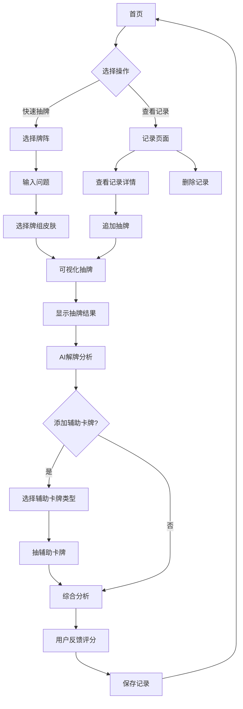

# AI塔罗师 - 产品需求文档 (PRD)

## 1. Product Overview
AI塔罗师是一款融合人工智能与传统塔罗占卜的在线应用，通过可视化抽牌交互、智能解牌分析、个性化学习优化，为用户提供准确、专业、沉浸式的塔罗占卜体验。

- **核心价值**: 将传统塔罗占卜与AI技术结合，提供智能、准确、可学习的解牌服务
- **目标用户**: 对塔罗占卜感兴趣的用户，包括初学者和资深爱好者
- **市场定位**: 提供专业级AI解牌服务的在线占卜平台

## 2. Core Features

### 2.1 User Roles
| Role | Registration Method | Core Permissions |
|------|---------------------|------------------|
| Normal User | Email/Google OAuth | 使用全部占卜功能，查看/管理解牌记录 |
| Admin | Backend only | 管理牌组、更新AI模型、查看系统数据 |

### 2.2 Feature Module
1. **首页**: 欢迎区域、快速抽牌入口、热门牌阵推荐、最近记录
2. **抽牌页面**: 牌阵选择、问题输入、可视化抽牌交互、牌组皮肤切换
3. **解牌页面**: 抽牌结果展示、AI智能解牌分析、辅助卡牌选择（雷诺曼/字卡）
4. **记录页面**: 解牌历史记录、记录详情查看、记录删除
5. **设置页面**: 个人信息管理、牌组皮肤设置、偏好设置

### 2.3 Page Details

| Page Name | Module Name | Feature description |
|-----------|-------------|---------------------|
| 首页 | Hero Section | 神秘氛围的欢迎界面，品牌展示 |
| 首页 | Quick Start | 一键进入抽牌的快捷入口 |
| 首页 | Featured Spreads | 热门推荐牌阵卡片展示 |
| 首页 | Recent Records | 用户最近的解牌记录列表 |
| 抽牌页面 | Spread Selection | 多种牌阵选择（三牌阵、凯尔特十字、时间之流等） |
| 抽牌页面 | Question Input | 用户输入占卜问题文本框 |
| 抽牌页面 | Card Drawing | 可视化抽牌动画，支持摄像头手势交互 |
| 抽牌页面 | Deck Skin | 切换不同风格的牌组皮肤 |
| 解牌页面 | Result Display | 抽中卡牌的牌面展示和位置说明 |
| 解牌页面 | AI Interpretation | AI生成的解牌分析内容 |
| 解牌页面 | Supplementary Cards | 选择雷诺曼、字卡等辅助卡牌 |
| 解牌页面 | Feedback | 用户对解牌结果的反馈评分 |
| 记录页面 | Record List | 按时间排序的解牌记录列表 |
| 记录页面 | Record Detail | 查看单条记录的完整解牌内容 |
| 记录页面 | Delete Record | 删除不需要的解牌记录 |
| 设置页面 | Profile | 用户信息编辑、头像设置 |
| 设置页面 | Deck Preferences | 选择默认牌组皮肤 |
| 设置页面 | Privacy | 隐私设置、数据管理 |

## 3. Core Process

### 3.1 Main User Flow
1. 用户进入首页，选择牌阵或点击快速抽牌
2. 输入占卜问题，选择牌组皮肤
3. 进行可视化抽牌（支持摄像头手势交互）
4. 查看抽牌结果和AI解牌分析
5. 可选：添加雷诺曼/字卡等辅助卡牌进行深度分析
6. 对解牌结果进行反馈评分
7. 保存解牌记录，可随时查看和管理

### 3.2 Flowchart

## 4. User Interface Design

### 4.1 Design Style
- **主色调**: 深紫色(#1a0a2e)、神秘蓝(#16213e)、金色(#d4af37)作为点缀
- **辅助色**: 银色(#c0c0c0)、深紫渐变
- **按钮风格**: 圆角、渐变效果、悬停发光效果
- **字体**: 主标题使用优雅衬线字体(Playfair Display)，正文使用现代无衬线字体(Roboto)
- **布局**: 卡片式布局、神秘氛围背景、优雅的阴影效果
- **图标**: 使用神秘符号风格的图标，配合lucide-react图标库

### 4.2 Page Design Overview

| Page Name | Module Name | UI Elements |
|-----------|-------------|-------------|
| 首页 | Hero Section | 神秘星空背景、渐变标题、光晕效果、悬浮动画 |
| 首页 | Quick Start | 大按钮、脉冲动画效果、悬停放大 |
| 首页 | Featured Spreads | 卡片网格、悬停翻转效果、阴影层次 |
| 抽牌页面 | Spread Selection | 横向滚动卡片、选中状态高亮、牌阵预览图 |
| 抽牌页面 | Card Drawing | 3D卡牌翻转动画、流畅过渡效果、粒子背景 |
| 解牌页面 | Result Display | 卡牌展示区域、位置标签、动画入场效果 |
| 解牌页面 | AI Interpretation | 渐变背景卡片、打字机效果文字展示 |
| 记录页面 | Record List | 时间线布局、卡片悬停效果、删除按钮交互 |

### 4.3 Responsiveness
- **Desktop-first**: 优先设计桌面端体验
- **Mobile-adaptive**: 响应式布局，移动端优化触控交互
- **Touch optimization**: 针对移动端优化抽牌手势交互

### 4.4 3D Scene Guidance
- **Environment**: 神秘星空背景，带有粒子效果
- **Lighting**: 柔和的环境光，卡牌区域聚光效果
- **Camera**: 抽牌时的聚焦动画，卡牌翻转时的视角变化
- **Interactions**: 卡牌翻转、飞入效果、粒子飘散动画
- **Post-processing**: 轻微的光晕效果，增强神秘氛围
