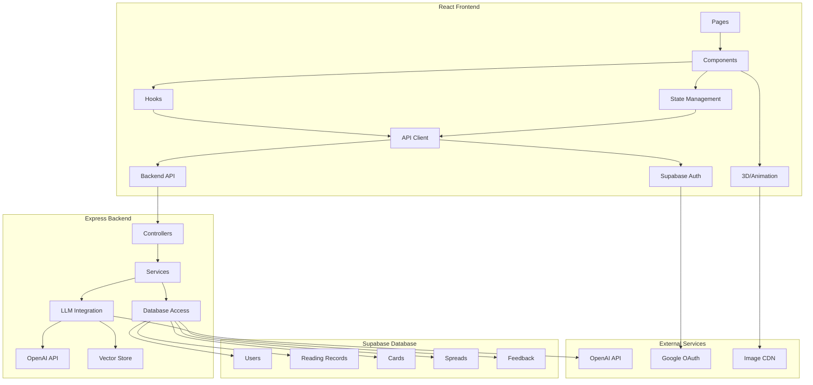
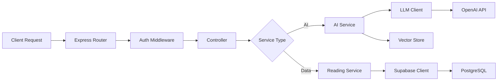
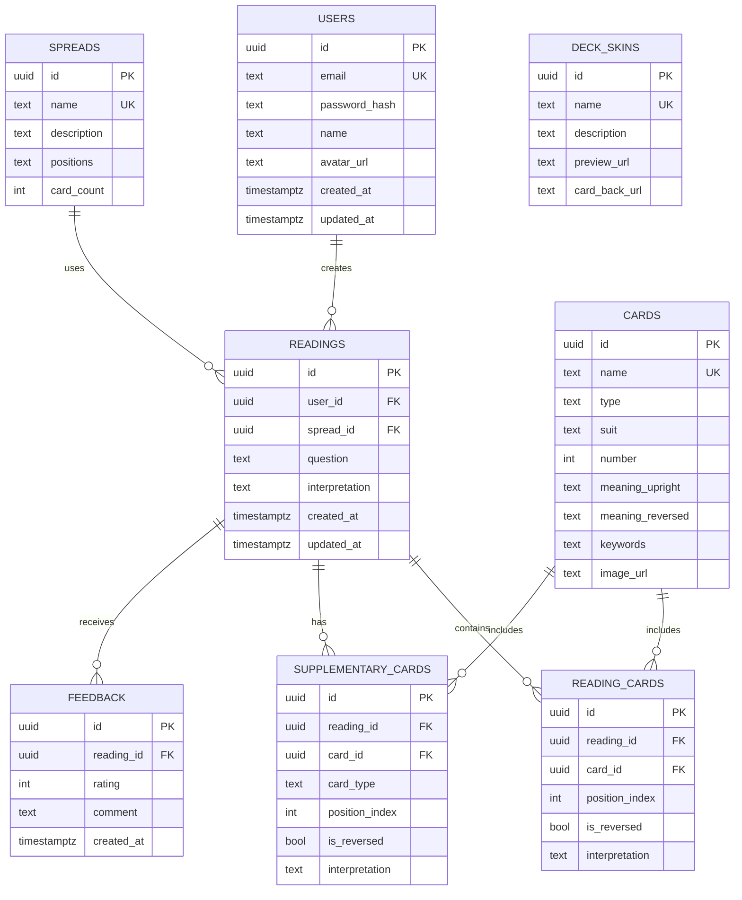

# AI塔罗师 - 技术架构文档

## 1. Architecture Design



## 2. Technology Description

### 2.1 Frontend

* **Framework**: React\@18 + TypeScript

* **Build Tool**: Vite\@6

* **Styling**: TailwindCSS\@3

* **State Management**: Zustand

* **Routing**: React Router DOM\@6

* **3D/Animation**: Framer Motion (2D animations), Three.js (3D effects)

* **Icons**: Lucide React

* **Camera Interaction**: MediaRecorder API + TensorFlow\.js (手势识别)

### 2.2 Backend

* **Framework**: Express\@4 + TypeScript

* **Database**: Supabase (PostgreSQL)

* **Authentication**: Supabase Auth (Email/Google OAuth)

* **LLM Integration**: OpenAI API (GPT-4o)

* **Vector Store**: Supabase Vector (pgvector)

* **Image Storage**: Supabase Storage

### 2.3 DevOps

* **Frontend Deployment**: Vercel

* **Backend Deployment**: Supabase Edge Functions / Vercel Functions

* **Database**: Supabase Managed PostgreSQL

* **CI/CD**: GitHub Actions

## 3. Route Definitions

| Route          | Purpose | Component    |
| -------------- | ------- | ------------ |
| `/`            | 首页      | HomePage     |
| `/draw`        | 抽牌页面    | DrawPage     |
| `/reading/:id` | 解牌结果页面  | ReadingPage  |
| `/records`     | 解牌记录页面  | RecordsPage  |
| `/settings`    | 设置页面    | SettingsPage |
| `/auth/login`  | 登录页面    | LoginPage    |
| `/auth/signup` | 注册页面    | SignupPage   |

## 4. API Definitions

### 4.1 Backend Routes

| Method | Route                         | Controller            | Purpose    | Auth Required |
| ------ | ----------------------------- | --------------------- | ---------- | ------------- |
| POST   | `/api/reading`                | reading.controller.ts | 创建新解牌记录    | Yes           |
| GET    | `/api/reading/:id`            | reading.controller.ts | 获取单条解牌记录   | Yes           |
| GET    | `/api/readings`               | reading.controller.ts | 获取用户解牌记录列表 | Yes           |
| DELETE | `/api/reading/:id`            | reading.controller.ts | 删除解牌记录     | Yes           |
| POST   | `/api/reading/:id/supplement` | reading.controller.ts | 添加辅助卡牌     | Yes           |
| POST   | `/api/reading/:id/feedback`   | reading.controller.ts | 提交反馈评分     | Yes           |
| GET    | `/api/cards`                  | card.controller.ts    | 获取卡牌列表     | No            |
| GET    | `/api/spreads`                | spread.controller.ts  | 获取牌阵列表     | No            |
| POST   | `/api/interpret`              | ai.controller.ts      | AI解牌分析     | Yes           |

### 4.2 Type Definitions

```typescript
interface Card {
  id: string;
  name: string;
  type: 'major' | 'minor';
  suit?: 'wands' | 'cups' | 'swords' | 'pentacles';
  number?: number;
  meaningUpright: string;
  meaningReversed: string;
  keywords: string[];
  imageUrl: string;
}

interface Spread {
  id: string;
  name: string;
  description: string;
  positions: SpreadPosition[];
  cardCount: number;
}

interface SpreadPosition {
  index: number;
  name: string;
  description: string;
}

interface Reading {
  id: string;
  userId: string;
  spreadId: string;
  question: string;
  cards: ReadingCard[];
  interpretation: string;
  supplementaryCards?: ReadingCard[];
  feedback?: Feedback;
  createdAt: Date;
  updatedAt: Date;
}

interface ReadingCard {
  cardId: string;
  positionIndex: number;
  isReversed: boolean;
  interpretation?: string;
}

interface Feedback {
  rating: number;
  comment?: string;
  createdAt: Date;
}

interface DeckSkin {
  id: string;
  name: string;
  description: string;
  previewUrl: string;
  cardBackUrl: string;
}
```

## 5. Server Architecture Diagram



## 6. Data Model

### 6.1 Data Model Definition



### 6.2 Data Definition Language

```sql
CREATE TABLE users (
    id UUID PRIMARY KEY DEFAULT gen_random_uuid(),
    email TEXT UNIQUE NOT NULL,
    password_hash TEXT,
    name TEXT,
    avatar_url TEXT,
    created_at TIMESTAMPTZ DEFAULT NOW(),
    updated_at TIMESTAMPTZ DEFAULT NOW()
);

CREATE TABLE spreads (
    id UUID PRIMARY KEY DEFAULT gen_random_uuid(),
    name TEXT UNIQUE NOT NULL,
    description TEXT,
    positions JSONB NOT NULL,
    card_count INTEGER NOT NULL,
    created_at TIMESTAMPTZ DEFAULT NOW()
);

CREATE TABLE cards (
    id UUID PRIMARY KEY DEFAULT gen_random_uuid(),
    name TEXT UNIQUE NOT NULL,
    type TEXT NOT NULL CHECK (type IN ('major', 'minor')),
    suit TEXT CHECK (suit IN ('wands', 'cups', 'swords', 'pentacles')),
    number INTEGER,
    meaning_upright TEXT NOT NULL,
    meaning_reversed TEXT NOT NULL,
    keywords TEXT[],
    image_url TEXT NOT NULL,
    created_at TIMESTAMPTZ DEFAULT NOW()
);

CREATE TABLE readings (
    id UUID PRIMARY KEY DEFAULT gen_random_uuid(),
    user_id UUID REFERENCES users(id) ON DELETE CASCADE NOT NULL,
    spread_id UUID REFERENCES spreads(id) NOT NULL,
    question TEXT NOT NULL,
    interpretation TEXT,
    created_at TIMESTAMPTZ DEFAULT NOW(),
    updated_at TIMESTAMPTZ DEFAULT NOW()
);

CREATE TABLE reading_cards (
    id UUID PRIMARY KEY DEFAULT gen_random_uuid(),
    reading_id UUID REFERENCES readings(id) ON DELETE CASCADE NOT NULL,
    card_id UUID REFERENCES cards(id) NOT NULL,
    position_index INTEGER NOT NULL,
    is_reversed BOOLEAN DEFAULT FALSE,
    interpretation TEXT
);

CREATE TABLE supplementary_cards (
    id UUID PRIMARY KEY DEFAULT gen_random_uuid(),
    reading_id UUID REFERENCES readings(id) ON DELETE CASCADE NOT NULL,
    card_id UUID REFERENCES cards(id) NOT NULL,
    card_type TEXT NOT NULL CHECK (card_type IN ('lenormand', 'oracle')),
    position_index INTEGER NOT NULL,
    is_reversed BOOLEAN DEFAULT FALSE,
    interpretation TEXT
);

CREATE TABLE feedback (
    id UUID PRIMARY KEY DEFAULT gen_random_uuid(),
    reading_id UUID REFERENCES readings(id) ON DELETE CASCADE NOT NULL,
    rating INTEGER NOT NULL CHECK (rating BETWEEN 1 AND 5),
    comment TEXT,
    created_at TIMESTAMPTZ DEFAULT NOW()
);

CREATE TABLE deck_skins (
    id UUID PRIMARY KEY DEFAULT gen_random_uuid(),
    name TEXT UNIQUE NOT NULL,
    description TEXT,
    preview_url TEXT NOT NULL,
    card_back_url TEXT NOT NULL,
    created_at TIMESTAMPTZ DEFAULT NOW()
);

CREATE INDEX idx_readings_user_id ON readings(user_id);
CREATE INDEX idx_reading_cards_reading_id ON reading_cards(reading_id);
CREATE INDEX idx_supplementary_cards_reading_id ON supplementary_cards(reading_id);
CREATE INDEX idx_feedback_reading_id ON feedback(reading_id);
```

## 7. AI解牌系统设计

### 7.1 LLM Integration

* 使用OpenAI GPT-4o进行塔罗牌解牌分析

* 构建专业的塔罗牌知识prompt，包含完整的牌意、解牌技巧、实际应用经验

* 支持上下文记忆，结合用户历史解牌记录进行更精准的分析

### 7.2 Vector Store

* 使用Supabase Vector存储塔罗牌知识向量

* 实现语义搜索，从外部知识库学习新的解牌方法

* 结合用户反馈优化解牌质量

### 7.3 Learning Mechanism

* **外部学习**: 定期从塔罗牌专业书籍、网站抓取知识，向量化存储

* **自我复习**: 基于历史解牌记录和反馈，生成训练数据，微调模型

* **反馈调整**: 根据用户反馈评分，优化prompt和知识库

## 8. 摄像头交互设计

### 8.1 Technology Stack

* **MediaRecorder API**: 获取摄像头视频流

* **TensorFlow\.js**: 手势识别模型

* **Framer Motion**: 交互动画

### 8.2 Gesture Controls

* **挥手**: 开始抽牌

* **抓取手势**: 选择卡牌

* **翻转手势**: 翻转卡牌

* **OK手势**: 确认抽牌结果

### 8.3 Fallback

* 提供鼠标/触摸交互作为摄像头交互的备选方案

